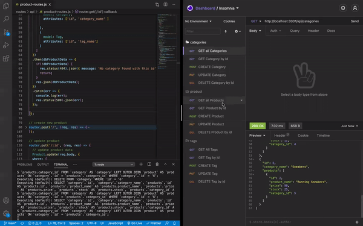
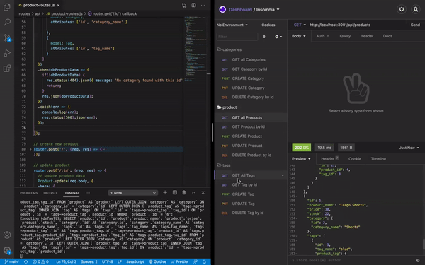

# ecommerce

## Purpose
This is a backend e-commerce site (CMS) that can be used to update employee's department, roles, and titles, and managers.

## Built with 
* JavaScript
* Express.js
* MySQL2
* Sequelize
* Dotenv

## Screenshot
### GET, POST, PUT, DELETE Routes for Category

### GET, POST, PUT, DELETE Routes for Product

### GET, POST, PUT, DELETE Routes for Tag

## User Story
* AS A manager at an internet retail company
* I WANT a back end for my e-commerce website that uses the latest technologies
* SO THAT my company can compete with other e-commerce companies

## Acceptance Criteria 
* GIVEN a functional Express.js API
* WHEN I add my database name, MySQL username, and MySQL password to an environment variable file
* THEN I am able to connect to a database using Sequelize
* WHEN I enter schema and seed commands
* THEN a development database is created and is seeded with test data
* WHEN I enter the command to invoke the application
*  THEN my server is started and the Sequelize models are synced to the MySQL database
* WHEN I open API GET routes in Insomnia Core for categories, products, or tags
* THEN the data for each of these routes is displayed in a formatted JSON
* WHEN I test API POST, PUT, and DELETE routes in Insomnia Core
* THEN I am able to successfully create, update, and delete data in my database

## Website
* https://latoyadawson.github.io/ecommerce/

## Contribution
Made with ❤️  by  Latoya Dawson

